# 📞 Maxima CX Website

🔗 [Live GitHub Preview](https://ralitsavoronevska.github.io/maxima-cx/)

<details>
<summary>📸 Screenshots</summary>

## 🖥️ Desktop preview:

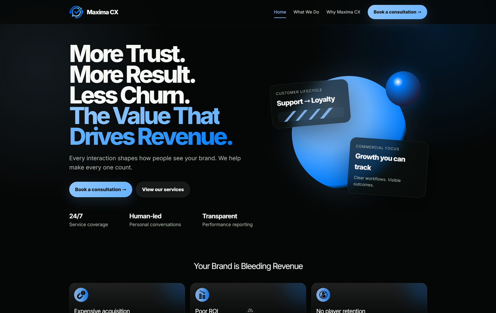

<table>
  <thead>
    <tr>
      <th colspan="2" style="text-align: center;">📱 Tablet Preview</th>
    </tr>
  </thead>
  <tbody>
    <tr>
      <td width="50%">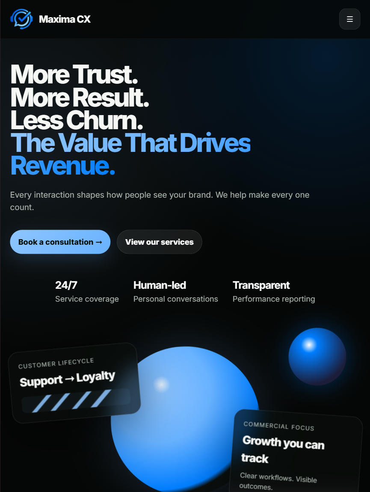</td>
      <td width="50%">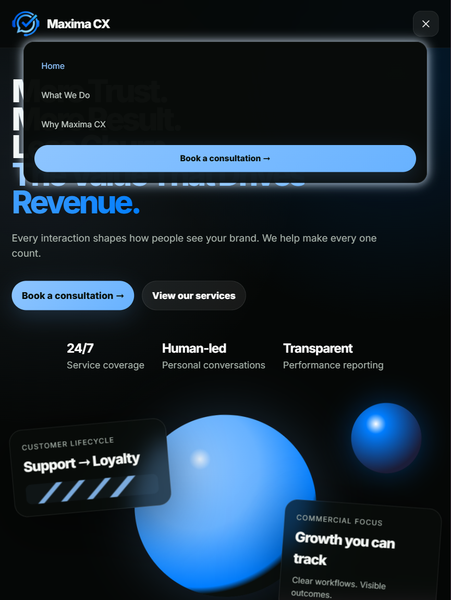</td>
    </tr>
  </tbody>
</table>

<table width="100%">
  <thead width="100%">
    <tr width="100%">
      <th colspan="2" style="text-align: center;">📱 Mobile Preview</th>
    </tr>
  </thead>
  <tbody>
    <tr>
      <td width="50%">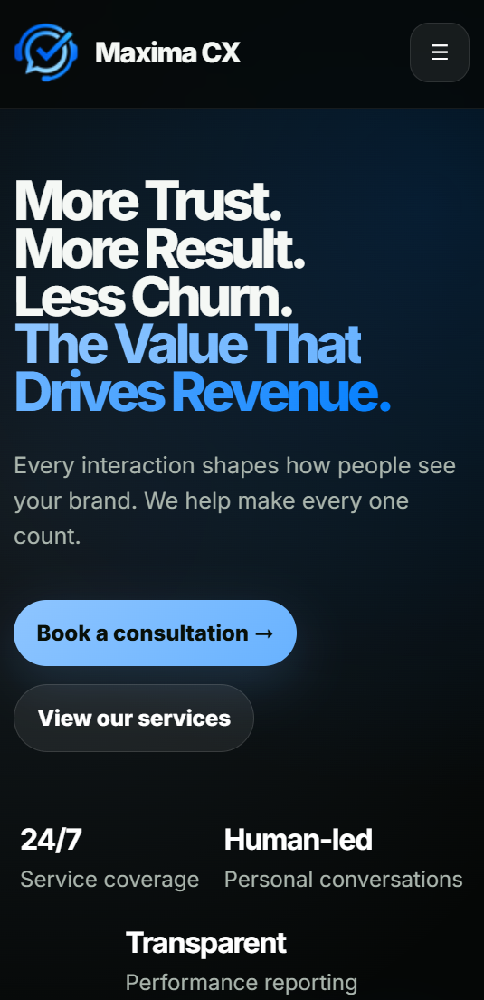</td>
      <td width="50%">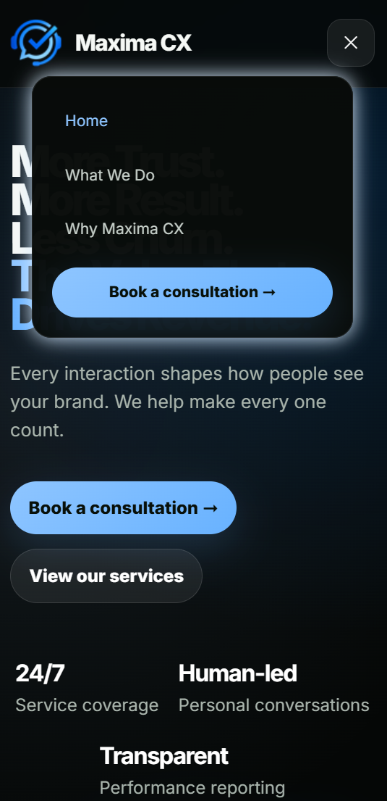</td>
    </tr>
  </tbody>
</table>

<br>

# 🏅 W3C HTML Validator

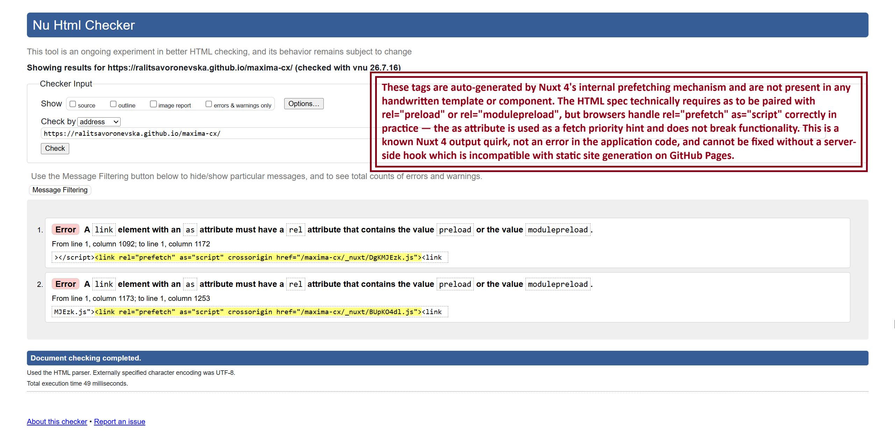

<br>

# 🏅 W3C CSS Validator

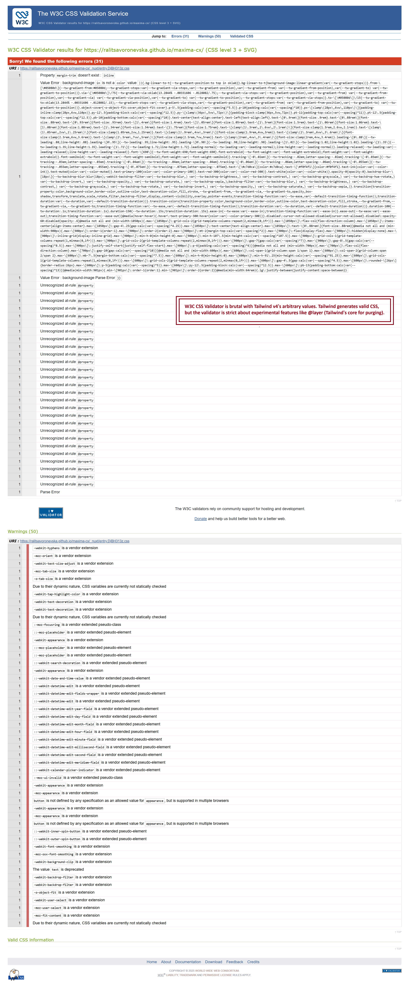

<br>

# 🌈 Chrome LightHouse Audit

Desktop:

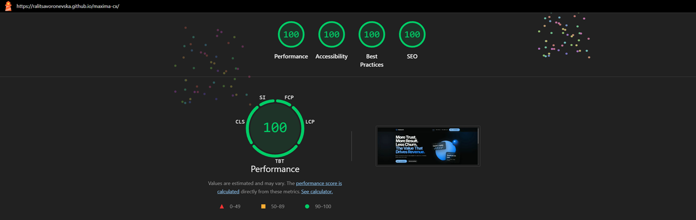

<br>

Mobile:

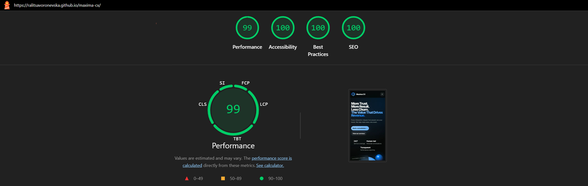

<br>

# ⚡ PageSpeed Insights Results

Desktop:

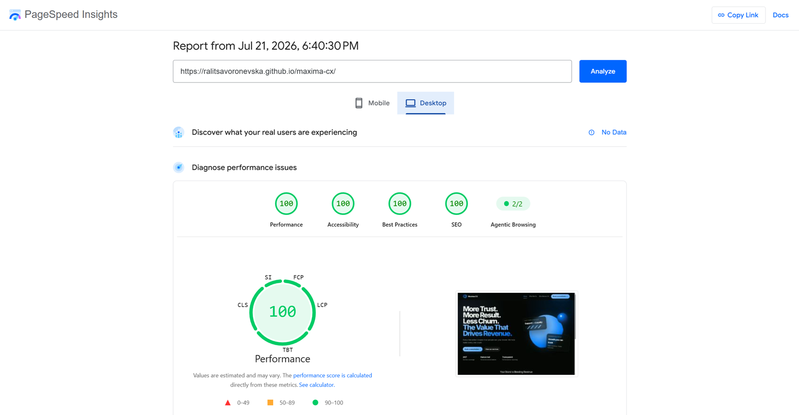

<br>

Mobile:

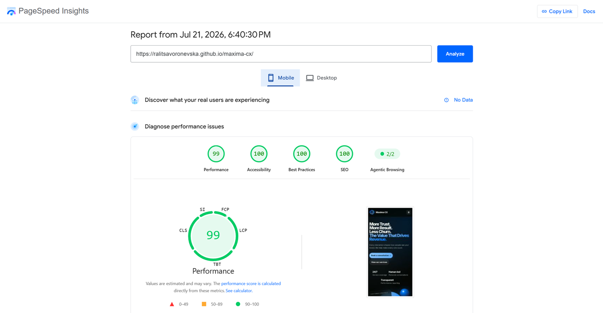

</details>  
        
<br>

</details>

<br>

# 🛠️ Built with:


  

    

🔨 Fully Responsive, Mobile First Approach, Transitions, Animations, Grid & Flex Layout  
⛏️ [Google Font: Poppins](https://fonts.google.com/specimen/Poppins/)

This is the newly created website for the brand Maxima CX. The design for
it was inspired by [Converst's Website](https://converst.com/). It uses the
[Nuxtship - Nuxt SAAS Starter Website Template](https://github.com/Gr33nW33n/nuxtship-template)
as a base.

<br>

# 🚀 Nuxtship - Nuxt SAAS Starter Website Template

Nuxtship is a free starter nuxt website template for saas, startups, marketing websites & landing pages.

The Nuxtship - Nuxt SAAS Starter Website Template is build on top of the Nuxt 3 Minimal Starter.

This Free Template is sponsored by [jakob-aichmayr.pages.dev](https://jakob-aichmayr.pages.dev/).

Look at the [Nuxt 3 documentation](https://nuxt.com/docs/getting-started/introduction) to learn more.

<br>

# 🧰 Online resources and tools:

🖼️ [Photopea [Online Photo Editor]](https://www.photopea.com/)

<br>

# 🌐 Browser Support:

(Last updated and tested: 21/07/2026)  
🌟 Chrome 150.0.7871.129 (64-bit)  
🦊 Firefox 152.0.6 (64-bit)  
🏴‍☠️ Opera 133.0.5932.60 (64-bit)  
🪟 Edge 150.0.4078.83 (64-bit)

<br>

# 🧪 Online Validators:

✔️ [W3C HTML Validator](https://validator.w3.org/)  
✔️ [W3C CSS Validator](https://jigsaw.w3.org/css-validator/)  
💡 [LightHouse Audit](https://developers.google.com/web/tools/lighthouse/)  
⚡ [PageSpeed Insights Audit](https://pagespeed.web.dev/)  
⭐ [WebPageTest](https://www.webpagetest.org/)

<br>

## Setup

Make sure to install the dependencies:

```bash
# npm
npm install
```

<br>

## Development Server

Start the development server on `http://localhost:3000`:

```bash
# npm
npm run dev
```

<br>

## Production

Build the static site:

```bash
# npm
npm run generate
```

Locally preview the production build:

```bash
# npm
npm run preview
```

Check out the [deployment documentation](https://nuxt.com/docs/getting-started/deployment) for more information.

<br>

## Deployment

This project deploys to GitHub Pages only. The current configuration in
[`nuxt.config.ts`](nuxt.config.ts) hard-codes the GitHub Pages base path
`/maxima-cx/`, the canonical origin
`https://ralitsavoronevska.github.io`, and the matching Web3Forms access key.

<br>

## GitHub Pages — automatic

Push to `master`:

```bash
git push origin master   # → CI builds & publishes to GitHub Pages
```

This triggers the [`Deploy to GitHub Pages`](.github/workflows/deploy.yml)
workflow, which runs `npm run generate` and publishes `.output/public` via the
official `upload-pages-artifact` / `deploy-pages` actions. Watch the **Actions**
tab; once it's green it's live. One-time setup: **Settings → Pages → Source**
must be **GitHub Actions**.

<br>

## Local development

Use the regular Nuxt dev server for local work:

```bash
npm run dev
```

For a static build, run:

```bash
npm run generate
```

The build is configured for the GitHub Pages sub-path, so it is deployed as-is by the Pages workflow.

<br>

## Contact form — the Web3Forms key

The contact form ([`app/pages/contact-us.vue`](app/pages/contact-us.vue))
submits to [Web3Forms](https://web3forms.com/), which needs an **access key** to
deliver submissions. The project uses a single GitHub Pages key in
[`nuxt.config.ts`](nuxt.config.ts), which is public by design and restricted in
the Web3Forms dashboard to the GitHub Pages host.

There is nothing to configure in the repo for this to work; the key is baked into
the static build at generation time. For local testing, you can override it with
an unrestricted dev key:

```bash
echo 'NUXT_PUBLIC_WEB3FORMS_KEY=your-dev-key' > .env
```

`NUXT_PUBLIC_WEB3FORMS_KEY` overrides the config value in local development.

<br>

## Rotating a key

Edit the key in [`nuxt.config.ts`](nuxt.config.ts) and rebuild/redeploy — there
is no repo secret or server env var to keep in sync.

<br>

# 🌟 Inspiration & Credits:

🪄 [Claude AI](https://claude.ai/)  
:octocat: [GitHub Coplit](https://github.com/features/copilot/)

---

🙌 Thank you for checking out my project! More is coming 🔜.  
Stay tuned 🚀 and please don't forget to give the project a star! ⭐  
Made with lots of 💗, ☕, and a sprinkle of ✨ by Ralitsa Voronevska!
